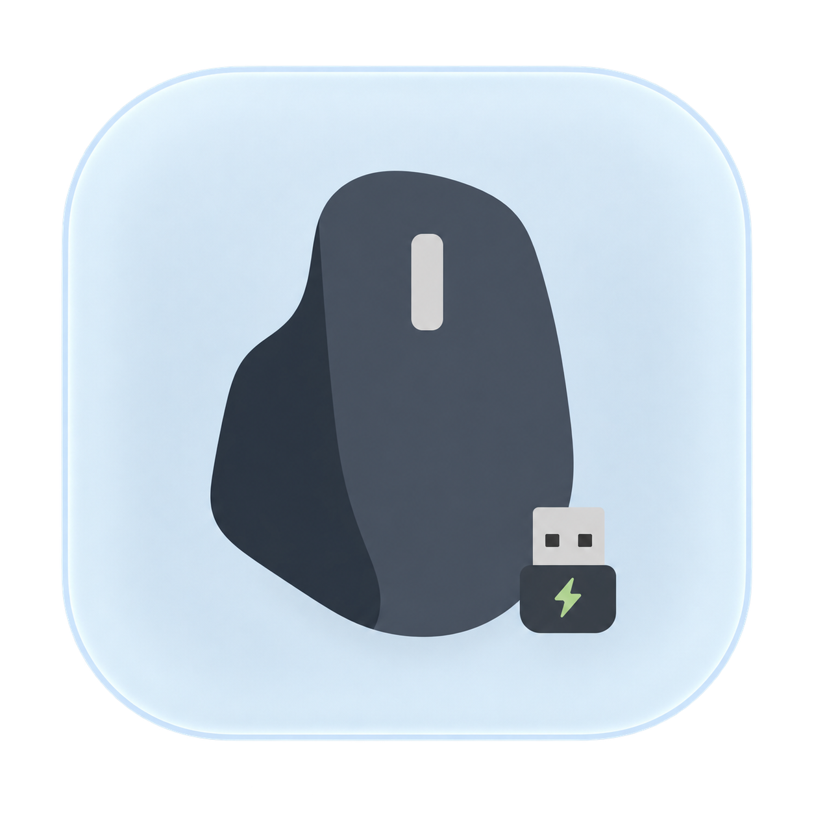
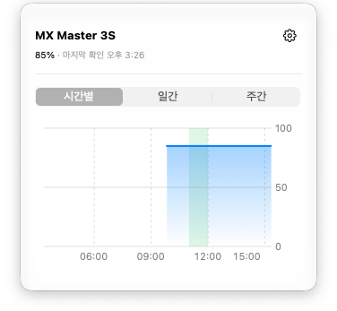

<p align="center">
  
</p>

<h1 align="center">Bolt Battery</h1>

<p align="center">
  <a href="https://github.com/heonny/BoltBattery/actions/workflows/ci.yml"></a>
  <a href="LICENSE"></a>
  
  
</p>

Logi Bolt 리시버로 연결된 Logitech 마우스의 배터리를 macOS 메뉴바에서 확인합니다.
마우스 설정을 변경하지 않으며, Options+와 함께 사용할 수 있습니다.

<p align="center">
  
</p>

## 주요 기능

- 메뉴바에 배터리 잔량과 충전 상태를 표시합니다.
- 아이콘과 퍼센트, 퍼센트만, 아이콘만 표시하도록 선택할 수 있습니다.
- 시간별·일간·주간 배터리 기록을 확인할 수 있습니다.
- 장치 재연결과 Mac 잠자기 해제 시 상태를 갱신합니다.
- 로그인 시 자동 실행과 진단 로그 저장을 지원합니다.
- 문제 확인용 진단 정보를 복사하고 배터리 기록을 CSV로 내보낼 수 있습니다.
- 배터리 부족 알림을 10%·20%·30% 이하로 설정할 수 있습니다. 기본은 꺼짐입니다.
- 시스템·라이트·다크 테마를 선택할 수 있습니다.

## 요구 사항

- macOS 13 이상
- Logi Bolt 리시버로 연결된 Logitech 마우스
- 소스 빌드 시 Swift 6을 지원하는 Xcode

Apple Silicon과 Intel Mac을 지원합니다. 실제 장치 동작은 MX Master 3S와 Bolt 리시버에서 확인했습니다. 다른 모델은 별도 확인이 필요합니다. Options+는 필수가 아닙니다.

## 설치

소스에서 직접 빌드합니다. 외부 패키지 설치는 필요하지 않습니다.

```sh
git clone https://github.com/heonny/BoltBattery.git
cd BoltBattery
scripts/release.sh
cp -R .build/BoltBattery.app /Applications/
open /Applications/BoltBattery.app
```

기존 앱이 실행 중이라면 종료한 뒤 설치합니다. 빌드 결과로 유니버설 앱과 DMG가 생성됩니다. 기본 빌드는 ad-hoc 서명을 사용하며 Apple 공증은 포함하지 않습니다.

## 개발 및 기여

```sh
swift build
swift test
scripts/make-app.sh debug
```

CI에서 단위 테스트와 유니버설 앱 빌드·서명을 검증합니다. 실제 리시버와 메뉴 UI는 로컬에서 확인합니다.

버그 제보와 개선 제안은 [Issues](https://github.com/heonny/BoltBattery/issues)에 남겨 주세요. 장치 모델, macOS 버전, 재현 방법을 함께 알려주시면 도움이 됩니다. Pull Request도 환영합니다.

개발 구조와 제약은 [개발 가이드](CLAUDE.md), UI 원칙은 [디자인 철학](docs/PHILOSOPHY.md)을 참고해 주세요.

## 라이선스

[MIT License](LICENSE)를 따릅니다.

HID++ 통신 구현에는 [Solaar](https://github.com/pwr-Solaar/Solaar)를 참고했습니다.
